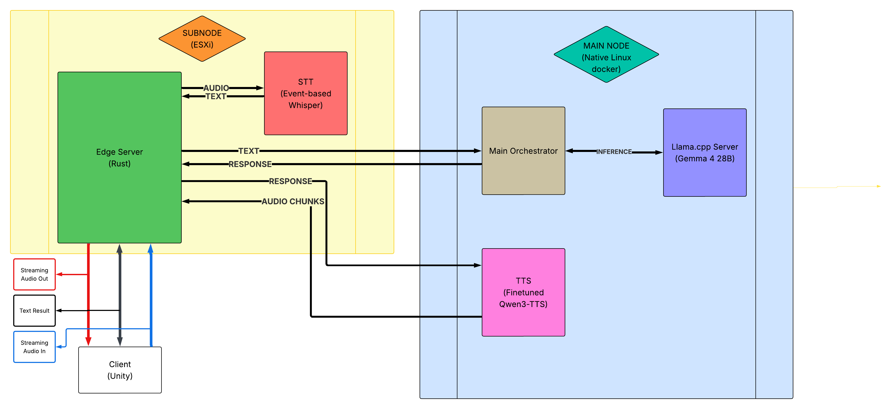

# deltaAnima

> Real-time conversational AI persona pipeline — voice in, voice out — built end-to-end across **Rust, C++, Python, and Unity** on self-hosted infrastructure.

deltaAnima turns a spoken utterance into an emotionally-inflected spoken reply through an
event-driven graph of microservices: streaming **STT → orchestration → VLM inference →
emotion modeling → streaming TTS**, with a Rust edge server routing every hop. The system spans
low-level GPU orchestration through a realtime 3D client, built by a cross-functional team of 5.

<!-- Optional badges: language split, license, build status -->
`Rust` · `C++` · `Python` · `C#/Unity` · self-hosted

---

## Demo

<!-- TODO: drop a short GIF/clip here. A 5-10s voice-to-voice loop is worth more than -->
<!-- any paragraph below it. Keep it at the very top once you have it. -->

> _Spoken question → streaming transcription → response → emotion-conditioned speech, end-to-end._

---

## The team & technical contributions

> **A vertically integrated production unit** spanning conceptual design, full-stack 3D asset pipelines, and low-level AI infrastructure.

 

* **[Justin Choi](https://github.com/your-github-id)** `Lead Systems & Infra` `Main Backend`
  * Engineered the core low-latency **Rust** edge routing server, replacing Python async overhead to handle heavy WebSocket multimedia streaming.
  * Built the **C++ emotion engine (deltaEGO)** with AVX-512 SIMD and cache-conscious memory layouts, exposed to Python via pybind11.
  * Designed the two-stage emotion pipeline and the persona backend (Reminh) — VAD read, deterministic emotion refinement, memory-conditioned response — and the orchestrator, including the `tts_request` dispatch to the TTS service.
  * Proposed the **main↔sub node split** that shapes the topology, and provided hardware + physical build-out support for its implementation; co-manages the infrastructure with Jay.
  * Contributed the TTS **dataset** (vocal-cord synthesis + Apollo voice-dataset conversion) feeding Jay's TTS training.
  * Bootstrapped the fully self-funded bare-metal homelab from the ground up: power delivery, physical multi-GPU allocation, and per-workload GPU/CPU placement.
  * _Builds on prior work:_ [Delta_me13_RE](https://github.com/namjuu3913/Delta_me13_RE) (local-LLM persona) → [deltaEGO v1](https://github.com/namjuu3913/from-VAD-vector-to-String-of-Emotion_onlyCode) (VAD→emotion, k-d tree) → deltaEGO v2 (AVX-512 SIMD).

* **[Mark](https://github.com/Longisrealll)** `Core AI` `Speech-to-Text`
  * Implemented and benchmarked the STT pipeline using customized Faster Whisper backends.
  * Optimized real-time audio chunking and tokenization for low-latency streaming transcription.

* **[Jay](https://github.com/jayng9663)** `Core AI` `Network & Infra Implementation`
  * Trained the finetuned TTS model and built the TTS streaming service, engineering concurrent audio buffering for uninterrupted real-time voice playback.
  * Realized the main↔sub topology by choosing and deploying **ESXi** (over Docker, for isolation/safety) and led the hands-on network engineering bridging the ESXi subnode with the Linux multi-GPU node.
  * Led the network routing logic and FortiGate-based secure operation; co-manages the infrastructure with Justin.

* **WonMin Kim** `Lead 3D Character Artist` `Technical Art`
  * Transformed 2D concepts into high-fidelity, optimized 3D character models built for real-time AI persona driving loops.
  * Authored mesh topology, rigging, and blendshapes for facial expressions synced to TTS audio.
  * Integrated the 3D character pipeline into the Unity frontend rendering loop.

* **Im HyoRim** `2D Concept Artist` `Persona UI/UX`
  * Established the visual identity and world-building of the AI persona through concept art and expression sheets.
  * Designed the interactive UX workflows and interface layouts for the multimodal conversational experience.

> Contribution note: the deltaAnima core (edge, orchestrator, persona backend, deltaEGO,
> GPU/CPU placement) is Justin's work. **Infrastructure was a collaboration:** Justin proposed
> the main↔sub node split and provided hardware/physical support; Jay chose ESXi to realize it
> (safer than Docker) and led the network engineering, with FortiGate his call for secure
> operation. Both co-manage the infrastructure. **TTS:** Jay trained the model and built the
> service; Justin supplied the training dataset (vocal-cord synthesis + Apollo conversion) and
> wrote the orchestrator-side `tts_request` dispatch.

---

## Architecture

deltaAnima is an **event-driven microservices graph** split across two physical nodes. A Rust
**edge server** is the single routing plane: services register by role and the edge statically
routes messages between them over a unified JSON + binary protocol. Latency-sensitive routing
lives on a lightweight ESXi subnode; heavy inference (VLM, TTS) and memory search run on a
GPU-dense native-Linux main node, while event-based STT is isolated on the subnode. See
[`docs/architecture.md`](./docs/architecture.md) for the message protocol and per-hop data flow.

---

## Highlights

- **Rust edge server as the routing plane** — role-based service registration and static
  routing between STT, orchestrator, TTS, and the Unity client over one JSON/binary protocol.
- **Two-stage emotion model** — the VLM *guesses* a VAD vector (persona only, no memory), then
  the C++ engine deltaEGO *refines* it deterministically before it conditions the response. A
  probabilistic read corrected by a reproducible module.
- **C++ emotion engine (deltaEGO)** — AVX-512 SIMD search over a personality-conditioned emotion
  space; int16-quantized with 64-byte alignment and core pinning, mapping OCEAN traits to dynamic
  physics weights. Exposed to Python via pybind11.
- **Streaming voice path** — event-based Whisper STT and a finetuned Qwen3-TTS service that
  streams audio chunks back through the edge for low first-chunk latency, played in Unity via a
  lock-free ring buffer.
- **Heterogeneous self-hosted topology** — edge + STT on an ESXi subnode, heavy inference on a
  native-Linux/Docker main node (RTX 5090 + RTX 3090), with placement chosen around workload
  predictability and GPU speed rather than convenience.
- **Owned end-to-end** — FortiGate firewall, reverse SSH tunnel, multi-user container, vector DB,
  and GPU scheduling are all part of the same design surface, not abstracted away.

---

## Tech stack

| Layer | Tech |
|---|---|
| Edge / routing | Rust |
| Emotion engine | C++ (AVX-512 SIMD, pybind11) |
| Services / orchestration | Python (FastAPI, asyncio) |
| VLM serving | llama.cpp (Gemma4-26B-A4B, Q4_K_M) |
| STT | Whisper (event-based) |
| TTS | Qwen3-TTS (finetuned) |
| Client | Unity / C# |
| Infra | ESXi, native Linux + Docker, FortiGate, reverse SSH |

---

## Performance

<!-- Measured on the current native-Linux setup. Add end-to-end latency once instrumented. -->

| Metric | Target | Measured |
|---|---|---|
| TTS RTF (RTX 3090) | < 1.0 | **~0.4** |
| Voice → first audio chunk | < 1 s | _TBD (instrumenting)_ |

The TTS RTF figure is the result of migrating off WSL2 to native Linux, which removed the GPU
passthrough overhead that had kept RTF above 1.0 — a ~3× throughput improvement. See
[infrastructure.md](./docs/infrastructure.md#tts-latency-solved) for the diagnosis.

---

## Documentation

The root README is the 30-second overview. Each subsystem and cross-cutting concern has its own
document under [`docs/`](./docs/).

| Doc | What's inside |
|---|---|
| [Architecture](./docs/architecture.md) | System graph, message protocol, per-hop data flow |
| [Infrastructure](./docs/infrastructure.md) | Node topology, networking (FortiGate, reverse SSH), ESXi/Docker placement |
| [Hardware](./docs/hardware.md) | Homelab specs, GPU placement rationale, travel-shuttle laptop |
| [Design decisions](./docs/design-decisions.md) | ADR-style tradeoffs — why Rust edge, why C++ emotion engine, why this placement |
| [Components](./docs/components/README.md) | Per-service deep dives |

### Components

| Component | Role |
|---|---|
| [Edge server](./docs/components/edge-server.md) | Rust routing plane, role-based registration |
| [STT](./docs/components/stt.md) | Event-based Whisper transcription |
| [Orchestrator](./docs/components/orchestrator.md) | Dialogue orchestration + VLM calls |
| [TTS](./docs/components/tts.md) | Finetuned Qwen3-TTS streaming synthesis |
| [deltaEGO](./docs/components/deltaego.md) | C++ SIMD emotion engine |
| [Reminh](./docs/components/reminh.md) | Persona backend + memory layer (RAG) |

---

## Status

| Doc | Owner | State |
|---|---|---|
| edge-server.md | Justin | ✅ |
| orchestrator.md | Justin | ✅ |
| reminh.md | Justin | ✅ |
| deltaego.md | Justin | ✅ |
| stt.md | Mark | ⬜ submodule — linked from Mark's repo (pending) |
| tts.md | Jay | ⬜ submodule — linked from Jay's repo (pending) |

---

<!-- Optional: contact / portfolio links -->
<!-- Built by Justin — [LinkedIn](#) · [Portfolio](#) -->
