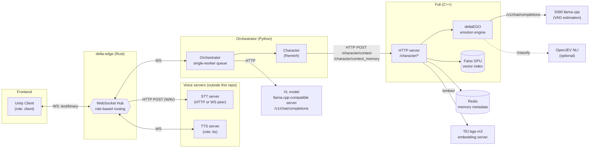
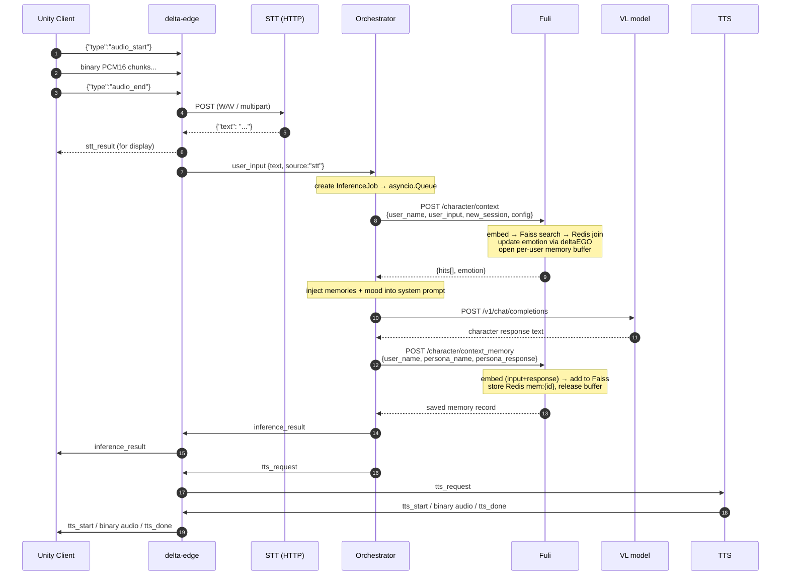
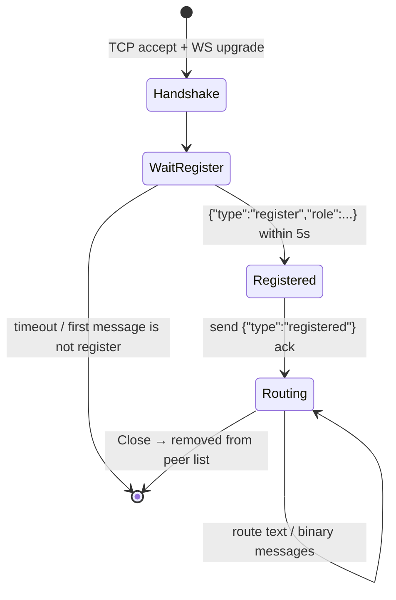
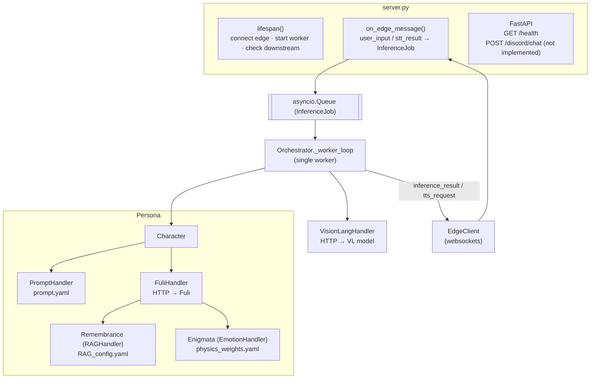
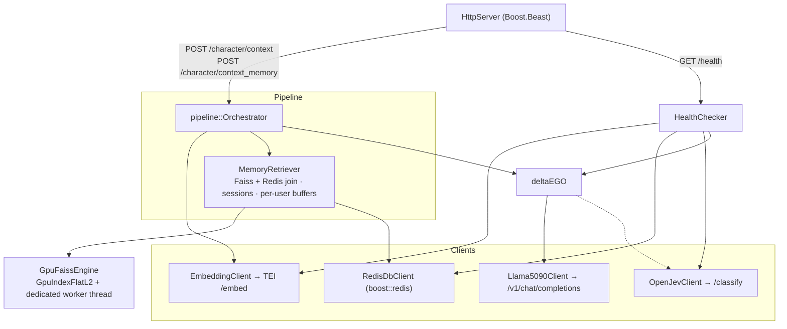
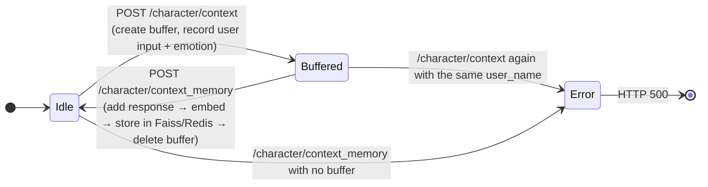
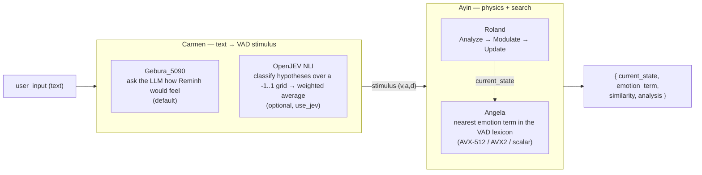
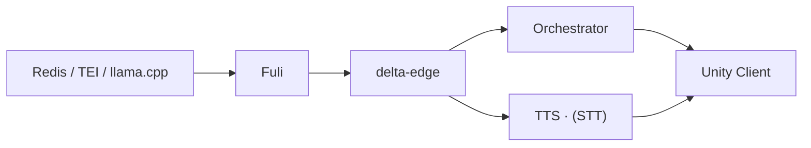

# deltaAnima

**deltaAnima** is a real-time, self-hosted backend for **Reminh**, an AI character that remembers past conversations and has a continuously evolving emotional state.

You talk to Reminh by voice (or text) through a Unity client. She recalls relevant past conversations, reacts emotionally in a way shaped by her personality, answers in character, and speaks the answer back — all running on our own GPU servers, with no cloud APIs.

<!-- TODO: add a demo GIF or video link here -->

---

## Why we built this

<!-- TODO (Justin): rewrite in your own words. Draft below. -->

Most AI chat characters are stateless: every conversation starts from zero, and their "personality" is just a paragraph in a prompt. We wanted to find out what it actually takes to build a character that **remembers you** and whose **mood carries over** from one message to the next — and to run the entire voice-to-voice loop in real time on hardware we own and operate ourselves.

That turned out to be as much a systems problem as a model problem: routing audio and messages between many services, keeping GPU-bound inference from contending, retrieving memories fast enough to stay conversational, and deploying it all across multiple machines on a segmented network.

---

## How it works (in plain terms)

Every time you say something to Reminh, one "turn" happens:

1. **Listen** — your voice is sent to a speech-to-text server and turned into text.
2. **Remember** — the text is turned into a vector and used to search Reminh's memory of past conversations with you.
3. **Feel** — Reminh's emotion engine estimates how *she* would feel hearing this, and moves her current mood accordingly. How strongly she reacts, and how quickly she calms down, depends on her personality.
4. **Think** — her memories and current mood are written into the prompt, and a language model generates her reply.
5. **Save** — the exchange (what you said + what she said + how she felt) is stored as a new memory.
6. **Speak** — the reply goes back to the Unity client as text and to a text-to-speech server, which streams her voice back.

The three services in this repository implement the "glue" and the "brain" of that loop:

| Directory | Service | Language / Runtime | Role |
|---|---|---|---|
| [`edge/`](edge/) | **delta-edge** | Rust (tokio, tungstenite) | WebSocket hub every service connects to. Role-based message routing + HTTP STT bridge |
| [`orchestrator/`](orchestrator/) | **Reminh Orchestrator** | Python (FastAPI, asyncio) | Inference job queue, persona prompt assembly, VL model calls, result delivery |
| [`fuli/`](fuli/) | **Fuli** | C++20 (Boost.Asio coroutines, Faiss GPU, Redis) | Embedding → vector search → memory storage, plus the **deltaEGO** emotion engine |

The speech (STT/TTS) servers, model servers, and Unity client live outside this repository.

> **Naming note:** "Orchestrator" refers to the Python service. Fuli also has an internal `pipeline::Orchestrator` class that coordinates its own request pipeline; the two are unrelated.

---

## Table of Contents

1. [Architecture](#1-architecture)
2. [Deployment](#2-deployment)
3. [Results](#3-results)
4. [Lifecycle of a Turn](#4-lifecycle-of-a-turn)
5. [delta-edge (Rust WebSocket Hub)](#5-delta-edge-rust-websocket-hub)
6. [Orchestrator (Python)](#6-orchestrator-python)
7. [Fuli (C++ Memory & Emotion Server)](#7-fuli-c-memory--emotion-server)
8. [deltaEGO Emotion Engine](#8-deltaego-emotion-engine)
9. [Build & Run](#9-build--run)
10. [Configuration Reference](#10-configuration-reference)
11. [Current Status & Known Limitations](#11-current-status--known-limitations)
12. [Team & Contributions](#12-team--contributions)
13. [Previous Version](#13-previous-version)
14. [Third-Party Data & Licenses](#14-third-party-data--licenses)

---

## 1. Architecture


```mermaid
flowchart LR
    subgraph Frontend
        U["Unity Client<br/>(role: client)"]
    end

    subgraph Edge["delta-edge (Rust)"]
        H{{"WebSocket Hub<br/>role-based routing"}}
    end

    subgraph Voice["Voice servers (outside this repo)"]
        STT["STT server<br/>(HTTP or WS peer)"]
        TTS["TTS server<br/>(role: tts)"]
    end

    subgraph Brain["Orchestrator (Python)"]
        O["Orchestrator<br/>single-worker queue"]
        C["Character<br/>(Reminh)"]
    end

    VL["VL model<br/>llama.cpp-compatible server<br/>/v1/chat/completions"]

    subgraph Fuli["Fuli (C++)"]
        F["HTTP server<br/>/character/*"]
        EGO["deltaEGO<br/>emotion engine"]
        FA[("Faiss GPU<br/>vector index")]
    end

    R[("Redis<br/>memory metadata")]
    TEI["TEI bge-m3<br/>embedding server"]
    L5090["5090 llama.cpp<br/>(VAD estimation)"]
    JEV["OpenJEV NLI<br/>(optional)"]

    U <-- "WS: text/binary" --> H
    H <-- "WS" --> O
    H <-- "WS" --> TTS
    H -- "HTTP POST (WAV)" --> STT
    O --> C
    C -- "HTTP POST /character/context<br/>/character/context_memory" --> F
    O -- "HTTP" --> VL
    F --> EGO
    F --> FA
    F --> R
    F -- "/embed" --> TEI
    EGO -- "/v1/chat/completions" --> L5090
    EGO -. "/classify" .-> JEV
```

**Key design points**

- **Hub-and-spoke**: the Client, Orchestrator, TTS (and optionally STT) never connect to each other directly. They all connect to `delta-edge` over WebSocket. Each connection first registers its **role**, and every message after that is routed statically by the `(sender role, message type)` pair.
- **Orchestrator ↔ Fuli is HTTP/JSON**: two calls per turn. One *before* inference to fetch memories and emotion (`/character/context`), and one *after* inference to store what the character actually said (`/character/context_memory`).
- **Heavy work lives in Fuli**: embedding, vector search, and emotion computation all happen on the C++ side. The Python side is a thin, stateless layer that only keeps per-character policy (RAG settings, OCEAN personality values) in YAML and sends it along with each request.
- **GPU-bound work is serialized on purpose**: the VL model runs as a single instance on a single GPU, so the Orchestrator processes jobs with one worker to avoid contention and out-of-memory failures.

---

## 2. Deployment

<!-- TODO (Justin): verify GPU/host placement matches the current setup. -->

deltaAnima runs on a small self-hosted cluster rather than a single machine:

- **Three VMware vSphere (ESXi) hosts**, with GPUs passed through 1:1 to dedicated VMs (RTX 5090, RTX 3090s, RTX 3050).
- **Network segmentation with a FortiGate firewall.** `delta-edge` is the only component exposed to clients and sits in an isolated DMZ; every other service runs on internal networks.
- **Model servers run as plain Docker containers** on GPU passthrough VMs. The workloads have fixed roles rather than elastic scaling needs, so a Kubernetes layer would add overhead without benefit.
- **Network-aware placement.** The hosts are interconnected at 1 Gbps, so the entire retrieval path — embedding, vector search, emotion scoring, Redis, and prompt assembly — is placed on a **single host**. A request crosses the host boundary only once in each direction instead of bouncing between machines for every sub-step.

---

## 3. Results

| Metric | Before | After | What changed |
|---|---|---|---|
| TTS real-time factor (RTX 3090) | > 1.0 (slower than real time) | ≈ 0.4 | Moved the node from Windows 11 + WSL2 to native Ubuntu 24.04; WSL2's WDDM overhead was the root cause (~3× throughput) |
| Emotion (VAD) inference latency | ~170 ms (VL model on RTX 5090) | ~30 ms (OpenJEV on RTX 3090, experimental) | Early port of emotion scoring to a small dedicated classifier. Fast, but output quality is not yet stable, so the 5090 path remains the default |

### End-to-end voice latency

Measured from the end of the user's speech, as logged by the Unity client for a single representative voice turn:

| Stage | Time | Cumulative |
|---|---|---|
| Speech-to-text result | 273 ms | 273 ms |
| Memory retrieval + emotion + response generation + memory save | ~814 ms | 1,087 ms |
| First TTS audio chunk | ~509 ms | **1,596 ms** |

The character starts speaking about **1.6 seconds** after the user stops talking. TTS then streamed 13.4 seconds of audio in about 6 seconds (RTF ≈ 0.45).

> This is a single measurement. A larger benchmark (median / p90 over many turns) and a per-stage breakdown inside the Orchestrator are planned once the Unity client is more stable.

---

## 4. Lifecycle of a Turn

The full sequence from the moment the user speaks until the turn completes (HTTP STT mode).


```mermaid
sequenceDiagram
    autonumber
    participant U as Unity Client
    participant E as delta-edge
    participant S as STT (HTTP)
    participant O as Orchestrator
    participant F as Fuli
    participant V as VL model
    participant T as TTS

    U->>E: {"type":"audio_start"}
    U->>E: binary PCM16 chunks...
    U->>E: {"type":"audio_end"}
    E->>S: POST (WAV / multipart)
    S-->>E: {"text": "..."}
    E-->>U: stt_result (for display)
    E->>O: user_input {text, source:"stt"}

    Note over O: create InferenceJob → asyncio.Queue
    O->>F: POST /character/context<br/>{user_name, user_input, new_session, config}
    Note over F: embed → Faiss search → Redis join<br/>update emotion via deltaEGO<br/>open per-user memory buffer
    F-->>O: {hits[], emotion}
    Note over O: inject memories + mood into system prompt
    O->>V: POST /v1/chat/completions
    V-->>O: character response text
    O->>F: POST /character/context_memory<br/>{user_name, persona_name, persona_response}
    Note over F: embed (input+response) → add to Faiss<br/>store Redis mem:{id}, release buffer
    F-->>O: saved memory record
    O->>E: inference_result
    E->>U: inference_result
    O->>E: tts_request
    E->>T: tts_request
    T->>E: tts_start / binary audio / tts_done
    E->>U: tts_start / binary audio / tts_done
```

> For text input, the Client skips steps 1–7 and sends `{"type":"user_input","payload":{"text":"..."}}` directly.

---

## 5. delta-edge (Rust WebSocket Hub)

Source: [`edge/src/`](edge/src/) — `main.rs` (accept loop), `hub.rs` (connections & routing), `routing.rs` (routing table), `stt.rs` (HTTP STT client)

### 5.1 Connection lifecycle


```mermaid
stateDiagram-v2
    [*] --> Handshake: TCP accept + WS upgrade
    Handshake --> WaitRegister
    WaitRegister --> Registered: {"type":"register","role":...} within 5s
    WaitRegister --> [*]: timeout / first message is not register
    Registered --> Routing: send {"type":"registered"} ack
    Routing --> Routing: route text / binary messages
    Routing --> [*]: Close → removed from peer list
```

- Peers are stored in a `DashMap` of `role → Vec<PeerHandle>`, so **multiple connections can share a role** (e.g. several Unity clients), and a message addressed to a role is **fanned out to every peer** with that role.
- Each connection has its own `mpsc` channel and send task, so one slow peer never blocks the others.

### 5.2 Roles and the routing table

| role | Who |
|---|---|
| `client` | Unity frontend |
| `stt` | WebSocket STT server (not needed in HTTP STT mode) |
| `orchestrator` | The Python server in this repo |
| `tts` | TTS server |

**Text messages** (`resolve_text` in `routing.rs`)

| Sender role | `type` | → Receiver role |
|---|---|---|
| `client` | `user_input` | `orchestrator` |
| `client` | `audio_input` | `stt` |
| `stt` | `stt_result` | `orchestrator` |
| `orchestrator` | `inference_result` | `client` |
| `orchestrator` | `tts_request` | `tts` |
| `tts` | `tts_start`, `tts_done` | `client` |

**Binary messages** (`resolve_binary`): `tts → client` (audio chunks), `client → stt` (raw audio)

If a message carries `"to": "<role>"`, the table is bypassed and the message is **routed explicitly**.

### 5.3 Message envelope

```jsonc
// Sending (peer → hub)
{ "type": "user_input", "to": null, "payload": { "text": "hello" } }

// Receiving (hub → peer) — the hub fills in "from"
{ "type": "user_input", "from": "client", "payload": { "text": "hello" } }
```

The hub never inspects `payload`; it forwards it as-is.

### 5.4 HTTP STT mode

When the `STT_URL` environment variable is set, audio from a `client` is **buffered by the hub itself** instead of being streamed to an STT peer.

1. `audio_start` → clear the per-connection buffer
2. Binary frames (PCM16 LE mono) → appended to the buffer (capped at `STT_MAX_SECONDS`; anything beyond is dropped)
3. `audio_end` → wrap the buffer in a WAV header and POST it to `STT_URL` (in a separate task)
4. Extract the transcript from the response (`{"text"}`, `{"transcript"}`, `{"result"}`, or a plain string are all accepted)
5. Send `stt_result` back to the requesting client and `user_input {source:"stt"}` to the Orchestrator. On failure, the client gets an `error` message.

Without `STT_URL`, audio is routed to a WebSocket `stt` peer as before.

---

## 6. Orchestrator (Python)

Source: [`orchestrator/`](orchestrator/)


```mermaid
flowchart TB
    subgraph server.py
        L["lifespan()<br/>connect edge · start worker · check downstream"]
        M["on_edge_message()<br/>user_input / stt_result → InferenceJob"]
        HTTP["FastAPI<br/>GET /health<br/>POST /discord/chat (not implemented)"]
    end

    EC["EdgeClient<br/>(websockets)"]
    Q[["asyncio.Queue (InferenceJob)"]]
    W["Orchestrator._worker_loop<br/>(single worker)"]

    subgraph Persona
        CH["Character"]
        PH["PromptHandler<br/>prompt.yaml"]
        RH["Remembrance (RAGHandler)<br/>RAG_config.yaml"]
        EH["Enigmata (EmotionHandler)<br/>physics_weights.yaml"]
        FH["FuliHandler<br/>HTTP → Fuli"]
    end

    VLH["VisionLangHandler<br/>HTTP → VL model"]

    EC --> M --> Q --> W
    W --> CH
    CH --> PH
    CH --> FH
    FH --> RH
    FH --> EH
    W --> VLH
    W -- "inference_result / tts_request" --> EC
```

### 6.1 Modules

| File | Description |
|---|---|
| [`server.py`](orchestrator/server.py) | Entry point. Initializes handlers, connects to the edge, turns messages into `InferenceJob`s, hosts the FastAPI app |
| [`orchestrator.py`](orchestrator/orchestrator.py) | Job queue with a **single worker**. The VL model is one instance on one GPU, so jobs run strictly one at a time to avoid contention and OOM |
| [`edge_client.py`](orchestrator/edge_client.py) | WebSocket client for the edge hub (`register` → listen loop, `send_routed`) |
| [`VisionLangHandler.py`](orchestrator/VisionLangHandler.py) | Client for a llama.cpp-compatible server. Checks the model is loaded via `/v1/models`, runs inference via `/v1/chat/completions` |
| [`config.py`](orchestrator/config.py) / [`config.yaml`](orchestrator/config.yaml) | Loader for every environment-specific value (IPs, ports, model). Runs a TCP-level liveness sweep at startup (`test_servers`) |
| [`Persona/Character.py`](orchestrator/Persona/Character.py) | One character = prompt + RAG policy + emotion policy + VL handler. **Infers sessions** (first request, or a request after 30 minutes of silence, starts a new session) |
| [`Persona/FuliHandler.py`](orchestrator/Persona/FuliHandler.py) | HTTP transport to Fuli. Responses are validated against Pydantic schemas (`RAG_schemas.py`) |
| [`Persona/PromptHandler.py`](orchestrator/Persona/PromptHandler.py) | Prompt templates for Unity/TTS, Discord text, and VAD inference |
| [`Persona/RAGHandler.py`](orchestrator/Persona/RAGHandler.py) | Turns the character's RAG policy into a `RAGQueryOrder`; flattens hits into `"<name>: <line>"` form |
| [`Persona/EmotionHandler.py`](orchestrator/Persona/EmotionHandler.py) | Loads OCEAN/physics weights and the emotion backend flags (`use_5090`, `use_openjev`, `fallback_to_5090`) |
| [`Server/Pydantic_frame.py`](orchestrator/Server/Pydantic_frame.py) | Pydantic models for HTTP requests/responses |

### 6.2 Adding a character

`Character` finds its config in `Persona/Config/<character name>/` automatically. Adding a character only means adding a folder.

```
Persona/Config/
├── Common/
│   └── VAD_inference_prompt.yaml   # VAD inference prompt shared by all characters
└── Reminh/
    ├── prompt.yaml                 # identity, appearance, guidelines, per-medium (Unity/Discord) rules and examples
    ├── RAG_config.yaml             # retrieval policy (top_k, thresholds, domain, fusion weights, ...)
    └── physics_weights.yaml        # OCEAN personality + emotion physics weights
```

`Character.__reload__(data)` re-reads all three configs from disk at runtime, or hot-swaps them in memory with a dict of the same shape (a shape mismatch raises).

### 6.3 Outgoing messages

```jsonc
// → client
{ "type": "inference_result", "payload": {
    "request_id": "…", "status": "success", "output_text": "…", "error": null,
    "memory": { /* memory record saved by Fuli (without query and user_id) */ } } }

// → tts (only on success)
{ "type": "tts_request", "payload": { "request_id": "…", "text": "…", "speaker": "reminh" } }
```

---

## 7. Fuli (C++ Memory & Emotion Server)

Source: [`fuli/`](fuli/) · Build target: `orchestrator_server`

Fuli runs on a **single-threaded `io_context` with C++20 coroutines**. Blocking work (Faiss GPU calls) is pushed to a dedicated worker thread, and the resulting `std::future` is awaited through `util::AwaitFuture` so the event loop never blocks.


```mermaid
flowchart TB
    HS["HttpServer (Boost.Beast)"]
    subgraph Pipeline
        ORC["pipeline::Orchestrator"]
        MR["MemoryRetriever<br/>Faiss + Redis join · sessions · per-user buffers"]
    end
    subgraph Clients
        EMB["EmbeddingClient → TEI /embed"]
        RD["RedisDbClient (boost::redis)"]
        OJ["OpenJevClient → /classify"]
        LL["Llama5090Client → /v1/chat/completions"]
    end
    GFE["GpuFaissEngine<br/>GpuIndexFlatL2 + dedicated worker thread"]
    EGO["deltaEGO"]
    HC["HealthChecker"]

    HS -- "POST /character/context<br/>POST /character/context_memory" --> ORC
    HS -- "GET /health" --> HC
    ORC --> EMB
    ORC --> MR
    ORC --> EGO
    MR --> GFE
    MR --> RD
    EGO --> LL
    EGO -.-> OJ
    HC --> EMB & RD & OJ & EGO
```

### 7.1 HTTP endpoints

| Method · Path | Request | Response |
|---|---|---|
| `POST /character/context` | `FuliContextRequest` — `user_name`, `user_input`, `context`, `new_session`, `config.rag_policy`, `config.emotion_policy_raw` | `{ hits: [{id, score, user_input, model_response}], emotion_json }` |
| `POST /character/context_memory` | `FuliContextSaveRequest` — `user_name`, `persona_name`, `persona_response` | Full saved `MemoryMetadata` (JSON) |
| `GET /health` | – | `{ status: "ok" \| "degraded", services: {...} }` |

Example requests/responses are in [`fuli/main_orch_files/`](fuli/main_orch_files/) for reference only (not used by the main code).

### 7.2 The `/character/context` pipeline

1. **Acquire a memory buffer** — `user_name` is hashed with MurmurHash3 (128-bit) into a `UserId`, which keys a per-user buffer.
2. **Resolve the session ID** — `MemoryRetriever` owns a per-user session UUID. `new_session=true` mints a fresh one.
3. **Embed** — if `rag_policy.dense_vector` is absent, the input is embedded with TEI (bge-m3, 1024 dims).
4. **First-pass retrieval** — Faiss is oversampled at `top_k × 5`, candidates are joined with Redis metadata and filtered by `session_id` and `importance_threshold`.
5. **Emotion branch** — `deltaEGO::sephirothic_tree(user_input)` updates the emotional state (see [Section 8](#8-deltaego-emotion-engine)).
6. **Assemble** — builds the response and records this turn's user input, emotion snapshot, and original request in the buffer.

### 7.3 Two-phase turn protocol (memory buffer)

A memory is stored as a **pair of user input and character response**, so every turn must be completed with two calls.


```mermaid
stateDiagram-v2
    direction LR
    [*] --> Idle
    Idle --> Buffered: POST /character/context<br/>(create buffer, record user input + emotion)
    Buffered --> Idle: POST /character/context_memory<br/>(add response → embed → store in Faiss/Redis → delete buffer)
    Buffered --> Error: /character/context again with the same user_name
    Idle --> Error: /character/context_memory with no buffer
    Error --> [*]: HTTP 500
```

- On the Python side, `Orchestrator._process` always calls `save_turn()` exactly once after a successful VL inference.
- The buffer is **always deleted**, even if the Store step fails, so the next turn is never blocked.

### 7.4 Storage

| Store | Contents | Notes |
|---|---|---|
| **Faiss** (`GpuIndexFlatL2`) | Embedding of `(user_input + model_response)`, ID = ID allocated by Redis | Saved to `data/memory_index.faiss` / `.ids`. Autosaved every 5 minutes and on SIGINT/SIGTERM |
| **Redis** | `mem:{id}` hash — conversation content, user/persona, emotion snapshot, session, timestamp, original request | IDs come from the `next_mem_id` counter (`INCR`). Nested fields are flattened with dot notation, e.g. `memory.content.user_input` |

> If no saved index exists, Fuli **seeds 200 random test vectors** (`SeedTestVectors`) so the pipeline can be verified end to end. Remove this before real use.

---

## 8. deltaEGO Emotion Engine

Source: [`fuli/src/deltaEGO/`](fuli/src/deltaEGO/)

deltaEGO represents the character's emotion as **a point in 3D VAD (Valence · Arousal · Dominance) space** and moves it physically in response to stimuli, in a way shaped by the character's personality (OCEAN).


```mermaid
flowchart LR
    T["user_input (text)"] --> CA

    subgraph CA["Carmen — text → VAD stimulus"]
        direction TB
        G5["Gebura_5090<br/>ask the LLM how Reminh would feel<br/>(default)"]
        OJV["OpenJEV NLI<br/>classify hypotheses over a -1..1 grid → weighted average<br/>(optional, use_jev)"]
    end

    CA -- "stimulus (v,a,d)" --> AY

    subgraph AY["Ayin — physics + search"]
        direction TB
        RO["Roland<br/>Analyze → Modulate → Update"]
        AN["Angela<br/>nearest emotion term in the VAD lexicon<br/>(AVX-512 / AVX2 / scalar)"]
        RO -- "current_state" --> AN
    end

    AY --> OUT["{ current_state, emotion_term,<br/>similarity, analysis }"]
```

### 8.1 Carmen — extracting a stimulus from text

- **Default path (5090)**: asks the llama.cpp server on the 5090 GPU machine, with a persona prompt (same idea as [`VAD_inference_prompt.yaml`](orchestrator/Persona/Config/Common/VAD_inference_prompt.yaml)), how *Reminh herself* would feel on hearing the message, returned as VAD JSON. The key point is that it estimates **the character's reaction**, not the speaker's emotion.
- **OpenJEV path (optional)**: builds a hypothesis for each candidate value on a per-axis grid, scores them with an NLI classifier, and uses the entailment-weighted average as the VAD. Still experimental.


### 8.2 Roland — personality-driven emotion physics

Each stimulus goes through three steps: `Analyze → Modulate → Update`.

**① Base physics coefficients from personality** (`updatePhysicsWeights`)

| Coefficient | Formula | Meaning |
|---|---|---|
| Positive sensitivity | `1 + E·w₁ + O·w₂` | Higher extraversion/openness → stronger reaction to positive stimuli |
| Negative sensitivity | `1 + N·w₃` | Higher neuroticism → stronger reaction to negative stimuli |
| Emotion resistance | `clamp(base + C·w₄ − O·w₅)` | Higher conscientiousness → emotions shift less easily |
| Decay rate | `clamp(base + C·w₆ − N·w₇)` | How fast the state returns to baseline |

**② Modulating coefficients from accumulated state** (`modulatePhysics`)

- Cumulative **stress ratio** above threshold → negative sensitivity increases (becomes touchier)
- **Affective lability** (sigmoid) above threshold → resistance decreases (mood swings)
- Cumulative **reward ratio** above threshold → decay rate increases (recovers faster)

**③ State update** (`updateEmotion`)

```
target  = stimulus × (V ≥ 0 ? positive sensitivity : negative sensitivity)   // D unchanged
current = lerp(target, current, resistance)                                 // move toward stimulus
radius  = (|A| + |V|) / 2                                                   // emotional intensity
current = lerp(current, default_state, decay rate)                          // pulled back to baseline
current = clamp(current, -1, 1)
```

### 8.3 Angela — mapping to an emotion term

Finds the emotion word closest to the updated VAD point in a VAD lexicon (entries look like `abandonment: V -0.744, A -0.14, D -0.596`). Coordinates are quantized into an Int16 tensor, and the CPU is detected at runtime to choose an **AVX-512 → AVX2 → scalar** distance kernel. The resulting `emotion_term` becomes `Reminh's Current Mood` in the Orchestrator's prompt.

> The lexicon file (`fuli/include/VAD_DB/VAD.json`) is **not included** in this repository for licensing reasons. See [Third-Party Data & Licenses](#14-third-party-data--licenses).

### 8.4 Example personality config

```yaml
# fuli/config/deltaEGO_default.yaml (== orchestrator/Persona/Config/Reminh/physics_weights.yaml)
OCEAN:
  Openness: 0.8
  Conscientiousness: 0.7
  Extraversion: 0.4
  Agreeableness: 0.9
  Neuroticism: 0.2
```

> deltaEGO currently reads **only `fuli/config/deltaEGO_default.yaml`, at server startup**. The `emotion_policy_raw` the Orchestrator sends with every request is parsed but not yet applied.

---

## 9. Build & Run

> All three services target **Linux** (`server.py` uses the `pwd` module; `run_server.sh` uses `taskset`/`setsid`).

> **Reproducing the full pipeline requires multiple GPUs** (a VL model server, an embedding server, and optionally STT/TTS). Each service can be built and started on its own, and Fuli can be built without a GPU using the mock Faiss engine (`-DENABLE_GPU=OFF`), but it still expects Redis and a TEI embedding server to be reachable.

### 9.1 Prerequisites (external services)

| Service | Purpose | Used by |
|---|---|---|
| Redis | Memory metadata | Fuli |
| [TEI](https://github.com/huggingface/text-embeddings-inference) + `bge-m3` | 1024-dim embeddings (`/embed`) | Fuli |
| llama.cpp server (5090) | VAD estimation | Fuli (deltaEGO) |
| llama.cpp-compatible VL server | Character response generation | Orchestrator |
| STT server | Speech recognition (HTTP or WS) | delta-edge |
| TTS server | Speech synthesis (connects to the edge as role `tts`) | delta-edge |
| OpenJEV (optional) | NLI-based VAD estimation | Fuli |
| NRC-VAD lexicon | Emotion term lookup (`VAD.json`, not included) | Fuli (deltaEGO) |

### 9.2 Recommended startup order


```mermaid
flowchart LR
    A["Redis / TEI / llama.cpp"] --> B["Fuli"]
    B --> C["delta-edge"]
    C --> D["Orchestrator"]
    C --> E["TTS · (STT)"]
    D & E --> F["Unity Client"]
```

The Orchestrator connects to the edge on startup, so **the edge must be up first**. Downstream servers being down does not block the Orchestrator from booting; it only logs them.

### 9.3 Fuli

Requirements: CMake ≥ 3.22, a C++20 compiler, Boost (system), OpenMP, yaml-cpp, Protobuf, gRPC, and for GPU builds CUDA Toolkit + Faiss (GPU). `asio-grpc`, `boost_redis`, and `concurrentqueue` are fetched automatically via CMake `FetchContent`.

```bash
cd fuli
cmake -S . -B build -DENABLE_GPU=ON      # without a GPU: -DENABLE_GPU=OFF (mock Faiss engine)
cmake --build build -j

./run_server.sh start                    # runs in the background pinned to CPUs 1-12 (override with CPU_LIST)
./run_server.sh status | logs [n] | restart | stop
```

Config paths (`config/`, `include/VAD_DB/`, `data/`) are **relative to the launch directory**, so the binary must be started from `fuli/` (`run_server.sh` does the `cd` for you). `stop` sends SIGTERM so the index is saved before exit.

Before starting, place the VAD lexicon at `fuli/include/VAD_DB/VAD.json` (see [Section 14](#14-third-party-data--licenses)).

### 9.4 delta-edge

Requirements: Rust (edition 2024 → rustc 1.85 or later)

```bash
cd edge
# optionally create a .env (see 10.1); it is loaded automatically via dotenv
cargo run --release
```

### 9.5 Orchestrator

Requirements: Python 3.10+

```bash
cd orchestrator
pip install fastapi uvicorn websockets requests pydantic pyyaml python-dotenv
python server.py
```

---

## 10. Configuration Reference

> ⚠️ Every address in the committed config is a `127.0.0.1:8080` **placeholder**. Running several services on one machine will cause port conflicts, so update them for your deployment.

### 10.1 delta-edge environment variables (`edge/.env`)

| Variable | Default | Description |
|---|---|---|
| `EDGE_BIND_ADDR` | `127.0.0.1:8080` | Hub bind address |
| `RUST_LOG` | `delta_edge=debug,info` | Log filter |
| `STT_URL` | (unset) | Enables HTTP STT mode when set, e.g. `http://host:port/transcribe` |
| `STT_FORMAT` | `multipart` | `multipart` \| `wav` \| `pcm` |
| `STT_FILE_FIELD` | `file` | Multipart file field name |
| `STT_TEXT_FIELD` | auto (`text`/`transcript`/`result`) | JSON field holding the transcript |
| `STT_SAMPLE_RATE` | `16000` | Sample rate of incoming PCM |
| `STT_TIMEOUT_SECS` | `30` | STT request timeout |
| `STT_MAX_SECONDS` | `60` | Max buffered audio per utterance (seconds) |

### 10.2 Orchestrator (`orchestrator/config.yaml`)

| Key | Description |
|---|---|
| `server.host`, `server.port` | FastAPI bind address |
| `edge.url` | Edge hub WS URL (the `EDGE_SERVER_URL` env var takes precedence) |
| `edge.role` | Role to register as (`orchestrator`) |
| `servers.*_server_ip` | `host:port` of each microservice. Leave blank to skip it in the liveness sweep |
| `vl_model.*` | VL server address/port, model alias and filename, `temperature`, `max_token`, `top_p` |
| `emotion_inference.backend` | `5090` \| `openjev` |
| `emotion_inference.fallback_to_5090` | Retry on 5090 if openjev fails |

- To use a different config file: `ORCHESTRATOR_CONFIG=/path/to/config.yaml`
- Secrets such as API keys belong in `.env`, not `config.yaml` (`.env` is gitignored).

### 10.3 Fuli (`fuli/include/config/constants.hpp`)

At the MVP stage these are **compile-time constants**; changing them requires a rebuild.

| Constant | Description |
|---|---|
| `kListenPort` | Fuli HTTP port |
| `kEmbeddingHost/Port` | TEI address |
| `kRedisHost/Port` | Redis address |
| `kLlama5090Host/Port` | llama.cpp address for VAD estimation |
| `kOpenJevHost/Port` | OpenJEV address |
| `kEmbeddingDim` | Embedding dimension (bge-m3 = 1024; must match the model) |
| `kFaissIndexPath` | Index save path (`data/memory_index`) |
| `kAutosaveIntervalSeconds` | Autosave interval (300 s) |

---

## 11. Current Status & Known Limitations

This repository is an MVP under active development. The following gaps are called out in code comments.

**Fuli**
- Of the RAG policy, only `top_k`, `session_id`, and `importance_threshold` are applied. Knowledge-base search, hybrid (sparse+dense) fusion, graph traversal, time decay, rerank, `min_score_threshold`, and chunk expansion are parsed but ignored.
- `emotion_policy_raw` (per-request personality values) is not applied yet.
- OpenJEV only runs a smoke test at startup; its VAD estimation path is opt-in and experimental.
- Session IDs and memory buffers live **in process memory only** and are lost on restart.
- Random test vectors are seeded when no saved index exists.
- The `io_context` is single-threaded. `proto/search_service.proto` (gRPC) is compiled into the build but not yet exposed as a service.

**Orchestrator**
- The active character is hardcoded to `Reminh`.
- `POST /discord/chat` is not implemented (`NotImplementedError`).
- `VisionLangHandler` currently handles text only (sending images is a TODO).
- The `speaker` in `tts_request` is hardcoded to `"reminh"`.

**delta-edge**
- There is no authentication. Any connection can register as any role, so only run it on a trusted internal network.

**Planned**
- Finish the OpenJEV port. The current version returns results quickly (~30 ms) but its VAD estimates are not yet stable enough to replace the 5090 path as the default.
- Stream LLM output to TTS sentence-by-sentence to reduce time to first audio.
- Hybrid search (sparse + dense) with RRF fusion and a reranker in Fuli ("RAG 2.0").
- Idle power saving: sleep model servers when unused and cold-start them on demand from the client.
- Larger latency benchmark (median / p90) with a per-stage breakdown once the Unity client is stable.

---

## 12. Team & Contributions

<!-- TODO (Justin): check names, spelling, and roles with each member before publishing. -->

deltaAnima is built by a five-person team.

| Member | Role |
|---|---|
| **Justin (JunHyeok Choi)** | Project lead and lead systems engineer. Overall architecture; delta-edge, Orchestrator, Fuli, and the deltaEGO emotion engine |
| **Jay** | TTS model training and server; ESXi / FortiGate network design / OpenJEV emotion classifier port in Fuli |
| **Mark** | Speech-to-text (STT) |
| **WonMin** | 3D character art |
| **HyoRim** | 2D concept art |

---

## 13. Previous Version

The first prototype (docs, edge, orchestrator, and an earlier Python-wrapped deltaEGO) is preserved on the [`legacy-v1`](../../tree/legacy-v1) branch.

---

## 14. Third-Party Data & Licenses

- **NRC-VAD Lexicon** — deltaEGO's emotion-term lookup uses the NRC Valence, Arousal, and Dominance Lexicon. Its license does not permit redistribution, so `VAD.json` is **not included** in this repository. To run deltaEGO, obtain the lexicon from its authors under their terms, convert it to the expected JSON format, and place it at `fuli/include/VAD_DB/VAD.json`.
  <!-- TODO (Justin): link the conversion script if it is included, and describe what happens when the file is missing. -->
- **bge-m3**, **Faiss**, **llama.cpp**, **TEI**, and other dependencies are used under their respective licenses.

<!-- TODO: add a LICENSE file for this repository's own code. -->