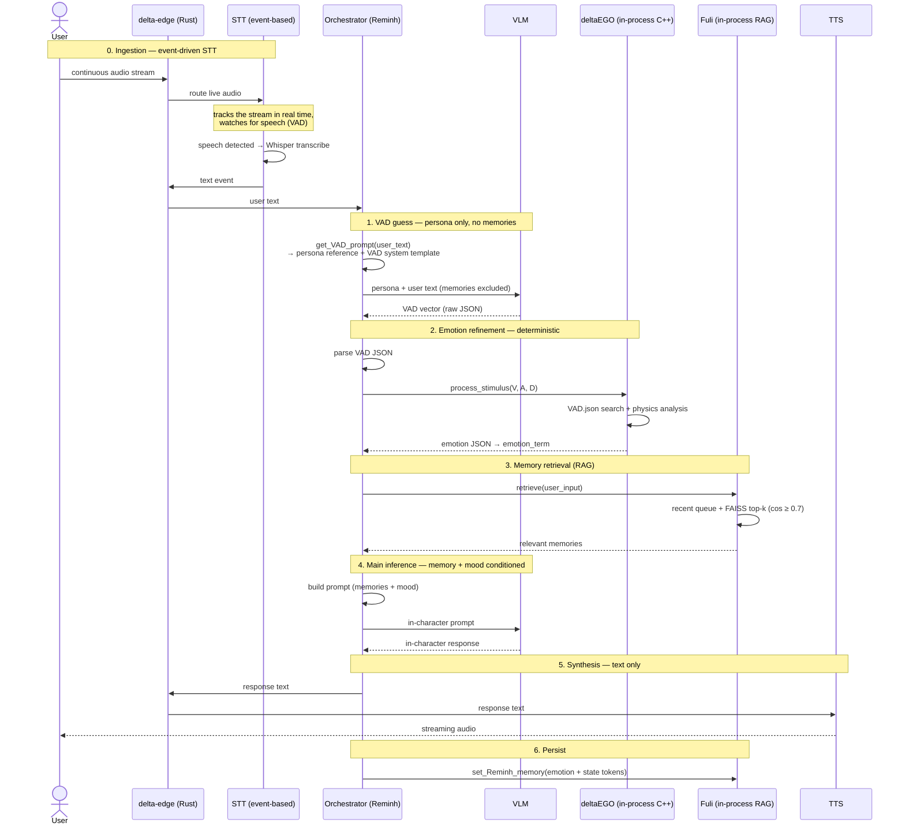

[← Back to README](../README.md)

# Architecture

This document describes the **logical structure** of deltaAnima — how a request flows through
the system and where responsibility boundaries sit. For *physical* placement (which node runs
what, networking) see [infrastructure.md](./infrastructure.md). For the reasoning behind these
choices, see [design-decisions.md](./design-decisions.md).

---

## System model

deltaAnima is an **event-driven microservices graph**. A Rust **edge server** is the single
routing plane: each service registers by role, and the edge statically routes messages between
them over a unified JSON + binary protocol.

A key boundary distinction: not everything in the request path is a network service. The
orchestrator hosts two of the most important components **in-process**, and the services are
split across two physical nodes (see [infrastructure.md](./infrastructure.md)).

| Component | Boundary | Node | Role |
|---|---|---|---|
| Unity client | network (via edge) | client | Capture mic audio, play streamed speech |
| `delta-edge` | network (routing plane) | subnode | Role-based registration, static routing |
| STT | network service | **subnode** (RTX 3050) | Event-based Whisper transcription |
| **Orchestrator** | network service | main node | Coordinates the full turn (the `Reminh` class) |
| ├─ deltaEGO | **in-process** (C++ / pybind11) | main node | Deterministic emotion refinement |
| ├─ Fuli | **in-process** (Python) | main node | Memory / RAG |
| └─ PromptHandler | **in-process** (Python) | main node | Prompt assembly |
| VLM | network service (llama.cpp) | main node (RTX 5090) | Vision-language model (Gemma4-26B-A4B); handles both the VAD read and the response, called directly by the orchestrator |
| TTS | network service | main node (RTX 3090) | Finetuned Qwen3-TTS, streaming synthesis |

The orchestrator talks to STT and TTS **through the edge**, but calls the VLM **directly**.
deltaEGO and Fuli are not network hops — they are a C++ extension module and a Python class
loaded inside the orchestrator process and invoked as ordinary method calls.

STT is deliberately placed on the **subnode**, isolated on its own GPU, because it is
event-based and fires at unpredictable times — keeping it off the main node prevents a
speech-detection spike from ever stealing resources from the latency-critical inference path.
See [infrastructure.md](./infrastructure.md#placement-rationale) for the placement reasoning.

---

## Request lifecycle

A single turn runs as a six-step pipeline. The defining feature is a **two-stage emotion
model**: the VLM *guesses* a VAD vector probabilistically, then deltaEGO *refines* it
deterministically.



### Step notes

0. **Ingestion (event-driven STT).** The Unity client streams microphone audio continuously to
   the edge, which routes it to the STT service. STT is **not** request/response — it tracks the
   live stream and runs voice-activity detection. When it detects speech, it automatically
   transcribes the segment with Whisper and emits a text event back through the edge to the
   orchestrator. Nothing downstream runs until a speech event fires. See
   [components/stt.md](./components/stt.md) for the detection details.

1. **VAD guess (persona only).** The emotion-guess prompt deliberately excludes retrieved
   memories. `get_VAD_prompt(user_text)` builds it from the persona reference plus a
   VAD-inference system template with the user's text interpolated in (via `PromptHandler`) — no
   memory is included. The VLM is instructed to reason like a psychologist and emit a VAD
   (Valence-Arousal-Dominance) vector. Keeping memories out of this stage prevents past context
   from biasing the *current* emotional read.

2. **Emotion refinement (deterministic).** The raw VAD vector is parsed and passed to deltaEGO
   (`process_stimulus`), a C++ engine that searches a custom VAD database and runs a physics
   analysis to map the vector onto a concrete emotion term plus state values. This converts a
   probabilistic VLM guess into a reproducible, tunable result.

3. **Memory retrieval (RAG).** Only now does Fuli run. It returns a blend of **recent
   conversation** (an in-memory queue) and **long-term memories** (FAISS top-k, cosine ≥ 0.7),
   embedded with bge-m3 (1024-dim). See [Reminh](./components/reminh.md) for the memory tiers.

4. **Main inference (conditioned).** The orchestrator assembles the final character prompt with
   the retrieved memories and the refined mood, then calls the VLM for the in-character
   response. Emotion is injected as prompt context here — it shapes the *generated text itself*,
   not a post-process.

5. **Synthesis (text only).** The response text is routed to TTS through the edge. **No emotion
   parameters are sent to TTS** — the emotional content already lives in the wording, so TTS
   only needs the text. This keeps the synthesis boundary simple.

6. **Persistence.** The turn (user input, response, refined emotion analysis, and stress/reward
   state tokens) is written back to Fuli so emotion accumulates across turns rather than being
   discarded.

---

## Why two VLM calls

A turn issues **two separate VLM calls** with different roles:

- **Call 1 — emotion read.** Persona + input, no memories, "act as a psychologist." Output is a
  structured VAD vector, not prose.
- **Call 2 — response.** Persona + memories + refined mood. Output is the in-character reply.

Splitting the emotional read from the response — and routing the read through a deterministic
refinement module before it conditions the response — is the central design choice of the
project. The rationale is covered in [design-decisions.md](./design-decisions.md).

---

## Data flow summary

```
live audio ──▶ STT (VAD)
                 │  speech detected → transcribe
                 ▼
               text ──▶ [ Orchestrator ]
                              │
                              ├─▶ VLM (VAD guess)        ── probabilistic
                              ├─▶ deltaEGO (refine)      ── deterministic
                              ├─▶ Fuli (RAG retrieve)
                              ├─▶ VLM (response)
                              └─▶ TTS (text) ──▶ audio
                              │
                              └─▶ Fuli (persist turn + emotion)
```

For per-component internals, see the [components](./components/README.md) directory.