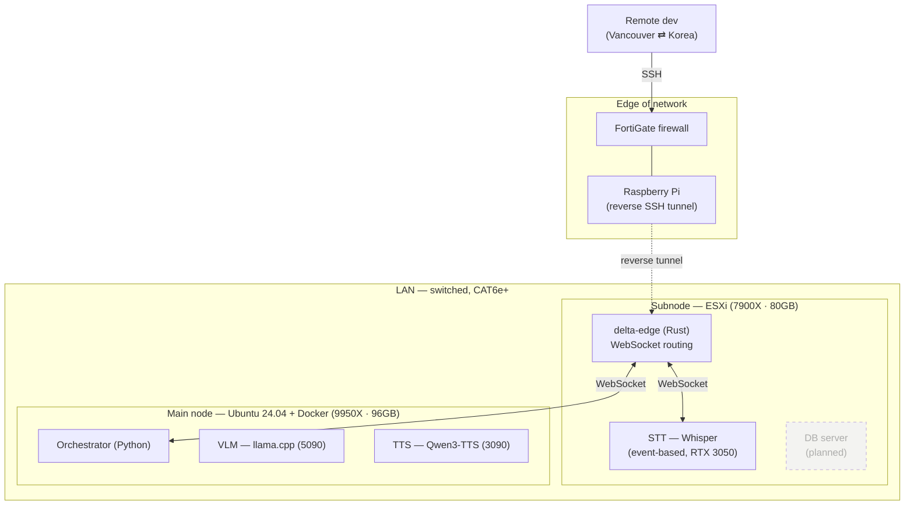

[← Back to README](../README.md)

# Infrastructure

This document describes the **physical deployment** of deltaAnima: the nodes, how compute is
placed across them, and how they talk to each other. For the *logical* request flow see
[architecture.md](./architecture.md); for raw hardware specs see [hardware.md](./hardware.md).

> **Current state vs. roadmap.** Today the system runs across two nodes: the **edge + STT** on
> the ESXi subnode, and **inference + TTS** on the main node (now native Ubuntu 24.04). The
> native-Linux migration and STT isolation are **done**; **database offloading** to the subnode
> is the main remaining roadmap item, called out explicitly so this document reflects what
> actually runs.

---

## Topology



Everything inside the LAN communicates over a **switched, CAT6e-or-better** wired network to
keep inter-node latency low — the edge↔orchestrator hop crosses the node boundary on every
turn, so physical-layer latency is part of the design budget, not an afterthought.

---

## Nodes

### Main node — inference

| | |
|---|---|
| CPU | Ryzen 9 9950X |
| GPU | RTX 5090 + RTX 3090 |
| RAM | 96 GB DDR5 |
| OS | Ubuntu 24.04 LTS (native) |
| Runtime | Docker (native, no WSL2) |

The Docker environment now runs on a dedicated, project-only host:

| Resource | Allocation |
|---|---|
| CPU | 24 of 32 threads (`cpuset: 4-15,20-31`) — cores 0-1 and 8-9 reserved for the OS |
| GPU | RTX 5090 (VLM) · RTX 3090 (TTS, FAISS) — all GPUs passed through |
| RAM | 75 GB of 96 GB (`memory: 75G`) |

STT no longer runs on the main node — it was moved to the subnode (see below).

### Subnode — routing, dev services, observability (+ future DB)

| | |
|---|---|
| CPU | Ryzen 9 7900X |
| GPU | RTX 3050 + RTX 3090 |
| RAM | 80 GB |
| Hypervisor | ESXi |

Running today (across ESXi VMs):

- **delta-edge** — the deltaAnima routing plane
- **STT** — event-based Whisper, isolated on the **RTX 3050** (see placement rationale)
- **GitLab** — shared instance for the cybersecurity club + personal project repos
- **Sub-project dev environments**
- **Grafana** — hardware/observability monitoring (see below)

Planned: move the **database server** here to offload the main node.

---

## Placement rationale

The interesting part of this setup is not the parts list — it's **why each piece sits where it
does.** Placement is chosen around the performance characteristics of each workload.

### GPU placement — split by workload predictability and speed

Placement follows two rules: put the slowest workload on the fastest card, and isolate the
*unpredictable* workload so it can't disturb the main path.

**Main node.** VLM inference is the longest pole in a turn, so it gets the fastest card
(**RTX 5090**). TTS and the bge-m3 embedding model behind FAISS share the **RTX 3090**. This is
reflected directly in code: the embedding model pins to `cuda:1` (the 3090), leaving `cuda:0`
(the 5090) free for inference.

```python
# Fuli.__check_gpu_avail()
return "cuda:1"  # using 3090 (cuda:0 = 5090, cuda:1 = 3090)
```

**Subnode — STT isolated on the RTX 3050.** STT is **event-based**: it fires whenever speech is
detected, at unpredictable times. If it shared a GPU with inference or TTS, a burst of STT
activity could momentarily steal VRAM/compute and slow the main pipeline. Moving STT onto the
subnode's **RTX 3050** removes that risk entirely — the main conversational path (VLM + TTS)
can never be slowed by a speech-detection spike, because STT lives on separate hardware on a
separate node. This is the point of the STT relocation: **isolate an unpredictable workload so
the latency-critical path stays clean.**

**TTS placement.** TTS runs on the main-node **3090** at **RTF ~0.4** (see
[TTS latency](#tts-latency-solved) for how that number was reached). It was briefly tested on
the 5090 while the bottleneck was being diagnosed, but the native-Linux migration resolved the
underlying issue, so TTS sits on its designed card. Thanks to a turbo-quantized Gemma, the 5090
still has headroom for one more small model alongside inference.

### CPU placement — dedicated machine, reserve only what the OS needs

Under the original Windows 11 + WSL2 setup, the Docker workload was pinned to a single CCD
(CCD1) to avoid colliding with the Windows host on CCD0. The native-Ubuntu migration changed
this: the main node is now a **dedicated, project-only machine**, so there's no competing host
workload to isolate against.

The strategy flipped accordingly. Instead of confining the workload to one CCD, the container
now spans **24 of the host's 32 threads** (`cpuset: "4-15,20-31"`), reserving cores 0-1 and 8-9
— full SMT sibling pairs — for the OS. On a dedicated box, isolating to a single CCD would leave
half the chip idle for no reason, so the workload takes almost everything and hands the OS just a
thin, cleanly-separated slice.

This is the more important lesson than the specific number: placement is chosen for the actual
environment. Single-CCD isolation was correct *while a Windows host contended for cores*; a
dedicated Linux box calls for the opposite — maximize usable cores, reserve a thin slice for the
OS.

### Subnode — routing + STT now, DB later

The edge is lightweight and STT is an isolated event-based workload (above), so both live on the
subnode rather than consuming main-node inference resources. The plan is to move the database
server here as well, so the main node stays dedicated to GPU inference while the subnode absorbs
routing, STT, and storage. The ESXi hypervisor is in place specifically to make that split
clean.

---

## Container & multi-user environment

The main-node workload runs in a single shared Docker container (`delta-anima:latest`) that
serves the whole team, with per-user isolation baked in:

- **Three isolated users** — Justin, Mark, and Jay each get their own home volume
  (`/srv/delta-users/<name>`) and a private NVMe-backed database mount
  (`/data/nvme_db/<name>_db`), so work and data don't collide inside the shared container.
- **Docker secrets for credentials** — per-user passwords are injected at build time via Docker
  `secrets` (files under `./secrets/`), never hardcoded into the image or compose file.
- **Deterministic GPU ordering** — `CUDA_DEVICE_ORDER=PCI_BUS_ID` fixes the GPU enumeration so
  `cuda:0`/`cuda:1` always map to the same physical cards. This is what makes the `cuda:1 = 3090`
  assignment in the Fuli code reliable across restarts.
- **Low-level tuning** — `ipc: host`, `memlock: -1` (unlocked pinned memory), and a 64 MB stack
  support the CUDA/inference workloads; `restart: always` keeps the service up.

The result is one reproducible image that three people can develop in simultaneously without
stepping on each other, with data isolation and secret management handled at the container
boundary.

---

## Networking

- **LAN:** all inter-node traffic is wired, switched, CAT6e+. Chosen to minimize the
  edge↔orchestrator round-trip that happens on every turn.
- **Service transport:** services communicate over **WebSocket**. `delta-edge` is the routing
  plane — services register by role and the edge routes messages between them.
- **Remote access:** development from outside the LAN (Vancouver ⇄ Korea travel) goes through a
  **reverse SSH tunnel** hosted on a **Raspberry Pi** that sits behind the **FortiGate**
  firewall. This exposes dev access without opening the main/subnode directly to the internet.

> **Credit.** Infrastructure is a collaboration: Justin proposed the main↔sub node split and
> provided hardware + physical support; Jay chose **ESXi** to realize it (over Docker, for
> isolation) and led the network engineering, with **FortiGate** his call for secure operation.
> Both co-manage the infrastructure. The deltaAnima core (edge, orchestrator, deltaEGO, GPU/CPU
> placement) is Justin's own work.

---

## Observability

A **Grafana** instance on the subnode monitors the whole fleet — every ESXi VM and the main
inference container — covering hardware health (GPU temps/utilization/VRAM, CPU, memory, etc.).
When something crosses a threshold, an **alert is pushed to phone**, so the homelab can be
operated unattended.

One deliberate exclusion: the **Windows host itself is not monitored**, to avoid leaking
personal data from the host OS into the monitoring stack. The boundary is drawn at the container
and VM level on purpose.

---

## TTS latency (solved)

The most significant infrastructure problem in the project — and its resolution — is worth
recording in full, because the diagnosis is the interesting part.

**Symptom.** TTS real-time factor (RTF) sat above 1.0, meaning speech synthesized slower than
real time — a hard blocker for a live conversational persona.

**Diagnosis.** The root cause was traced to **WSL2's GPU passthrough (WDDM) kernel-launch
overhead**, not the model or the GPU. Under WSL2, per-kernel launch cost dominated, which showed
up as low GPU utilization during TTS despite the card being capable. A collaborator's native
Linux node running the same TTS achieved a far lower RTF, which isolated the environment — not
the workload — as the culprit.

**Fix.** Migrated the main node from Windows 11 + WSL2/Docker to **native Linux**, removing the
WDDM passthrough layer entirely.

**Result.** TTS streaming throughput improved roughly **3×**, bringing RTF down to **~0.4 on the
RTX 3090** — comfortably faster than real time, with TTS back on its designed GPU.

> Takeaway: the bottleneck was an environment boundary, not the compute. Measuring GPU
> utilization per stage (STT vs. VLM vs. TTS) is what pointed at the passthrough layer rather
> than the model.

---

## Roadmap

- [ ] Move the database server onto the ESXi subnode (offload the main node)
- [x] ~~Native-Linux migration on the main node~~ — **done**; resolved the TTS RTF bottleneck
- [x] ~~Finalize TTS placement~~ — **done**; TTS on the 3090 at RTF ~0.4

See [design-decisions.md](./design-decisions.md) for the reasoning behind these directions.